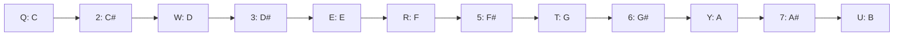
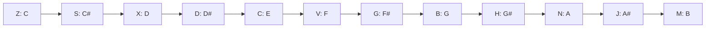

# TeTrackT

TeTrackT is a terminal music tracker for chiptune and retro-style music.

## Installing

Install prebuilt binaries from GitHub Releases:

- Go to releases page: <https://github.com/saintedlama/tetrackt/releases>
- Download the archive for your platform.
- Extract it to a directory of your choice.
- Run the executable from that directory.

If a release for your platform is not available yet, build from source:

```sh
go build .
```

Built-in songs included:

- Press `Ctrl+l` to open the load dialog, then press `Enter` on "Quickstart" or "Demo Song".
- Optional file-based module: `modules/quickstart.json`
- Full chiptune demo module: `modules/chiptune-demo.json`
- You can also press `Ctrl+l` to open the load dialog and select a `.json` module.

## Features

- Tracker-focused TUI workflow built with Bubble Tea and Lip Gloss.
- Integrated synthesizer engine with per-track synth settings.
- Oscillator and tone-shaping features:
  - multiple oscillator waveforms
  - wavetable support
  - pulse-width control
  - LFSR/noise options
- Modulation and dynamics:
  - ADSR envelope controls
  - LFO modulation (pitch, volume, cutoff, pulse width)
  - filter and filter envelope controls
- Performance and sequencing tools:
  - arpeggio, portamento, detune, and gate behaviors
  - effect processing and per-track mixer support
  - speed and tracker UX improvements (navigation/editing helpers)
- Presets and persistence:
  - synth patch bank presets
  - save/load module data via JSON

## Using The Tracker

The tracker now has a modern two-mode workflow.

Input profile:

- Default profile is `QWERTY`.
- To use `QWERTZ` mapping, set `inputProfile: qwertz` in `~/.tetrackt`.

Default QWERTY note layout for upper and lower rows:





- `Space`: toggle between `NAV` (navigate) and `EDIT` (write values).
- `Ctrl+Left` / `Ctrl+Right`: switch between Tracker and Settings panels.
- `Tab` / `Shift+Tab`: move subcolumn focus within the grid.

Tracker grid controls:

- `Arrow keys`: move row/track cursor.
- `PgUp` / `PgDn`: jump by viewport height.
- `Home` / `End`: jump to first/last row.
- `Z-M` and `Q-U`: enter natural notes in `EDIT` mode.
- `S D G H J` and `2 3 5 6 7`: enter sharp notes.
- `0-9` / `A-F`: hex entry for focused subcolumns (volume/effects).
- `Effect` column: command nibble `0..7` (or aliases `V S C D T O A`).
- `Param` column: two hex nibbles apply command immediately.
- `Delete`: clear the focused subcolumn.
- `Alt+C` / `Alt+X` / `Alt+V`: copy, cut, and paste block selection.
- `Alt+Shift+V`: paste effects only (keep destination note).
- `Shift+Arrow`: create/extend rectangular selection.
- `Alt+Up` / `Alt+Down`: transpose selected notes (or current note) by semitone.
- `Alt+Shift+Up` / `Alt+Shift+Down`: transpose by octave.
- `F8` / `F7` and `Shift+F8` / `Shift+F7`: transpose aliases.
- `Insert`: insert space in current track at cursor row.
- `Shift+Insert`: insert row space across all tracks.

Inline effect command map (`Effect` + `Param`):

- `0xx`: no effect (`00` clears effect lane)
- `1xy`: vibrato (`x` speed, `y` depth nibble)
- `2xx`: volume slide (`xx` interpreted as signed int8, e.g. `F8` = `-8`)
- `3xx`: note cut at sub-tick `xx`
- `4xx`: note delay at sub-tick `xx`
- `5xx`: row tick override (`00` clears, `01..20` valid)
- `6xx`: continuous mode (`00` off, `01` on)
- `7xy`: arp preset+step (`x` preset 0..5, `y` step bucket; `0` step defaults to 4)

Arp presets for `7xy`:

- `x=0`: clear arp
- `x=1`: up
- `x=2`: down
- `x=3`: converge
- `x=4`: diverge
- `x=5`: random

Settings panel controls:

- `Up` / `Down`: choose Volume or BPM.
- `Left` / `Right`: adjust selected value.
- `Shift+Left` / `Shift+Right`: larger adjustment.

Playback and utilities:

- `p`: play/pause from row 0.
- `P`: loop to current row.
- `Ctrl+e`: open advanced row effects dialog (optional fallback; inline editing is primary).
- `Ctrl+t`: toggle between Tracker and Synth screen.
- `Ctrl+l`: open load dialog.
- `Ctrl+s`: open save dialog.
- `?`: open in-app keyboard help.

## Contributing

Contributions are welcome.

- Fork the repo and create a feature branch.
- Make crazy changes.
- Open a pull request
